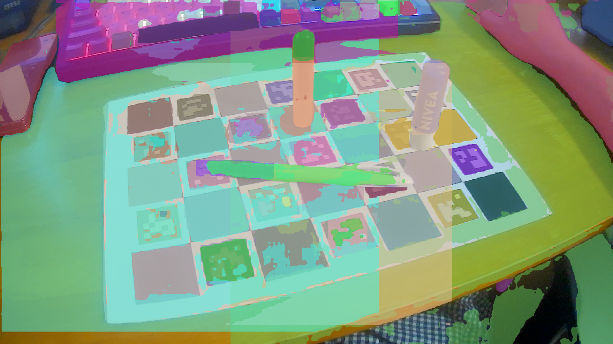
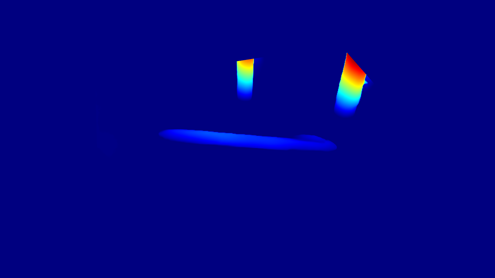
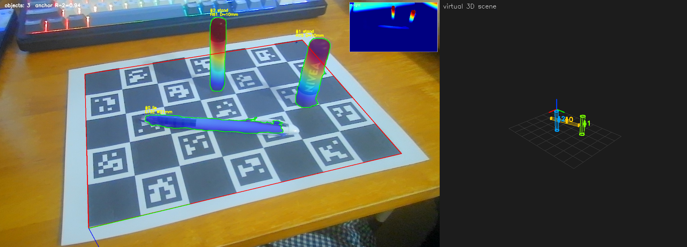
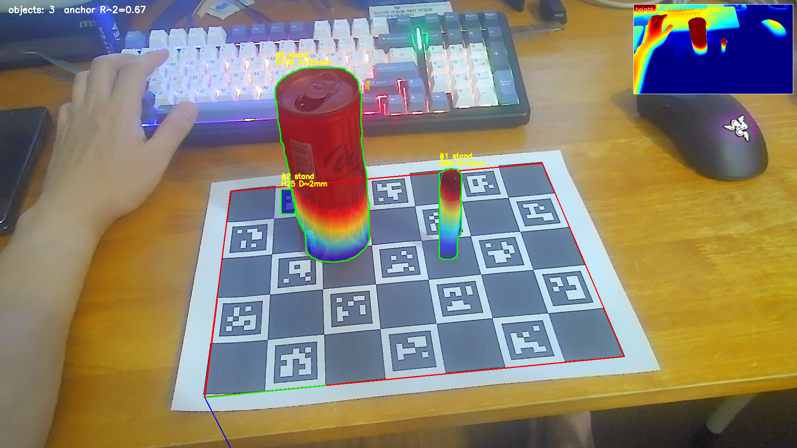

# 2D → 3D Object Change

**웹캠과 ArUco 마커만으로, RGB-D 같은 비싼 깊이 센서 없이, 한 장의 2D 사진에서 물체의 위치·크기·자세를 3D로 복원하고 가상 공간에 배치하는 프로젝트.**

로봇팔이 작업 공간의 물체를 인식하도록 하는 것이 최종 목표다.


*왼쪽: 카메라 화면(검출·높이 히트맵). 오른쪽: 가상 3D 공간에 마커 지도 + 물체(원통)가 배치된 모습.*

---

## 1. 왜 시작했나 (배경)

기존에는 **카메라 2대(스테레오) + 캘리브레이션**으로 2D 사진을 3D로 바꿨는데,
- 캘리브레이션이 **느리고 복잡**하고,
- 좌표값이 **부정확**했다.

그래서 다음 질문에서 출발했다:

> **웹캠 1대 + ArUco 정보만으로, 2D 사진 속 물체의 3D 정보(위치·크기·자세)를 어디까지 만들 수 있을까?**
> 이게 되면 비싼 RGB-D 카메라 없이 간단하게 전 과정을 처리할 수 있다.

---

## 2. 겪은 문제들

| # | 문제 | 원인 |
|---|---|---|
| 1 | **무보정 단일 사진의 부정확** | 스케일·깊이가 카메라 **화각(FOV) 추정**에 민감. 화각이 틀리면 거리가 통째로 틀어짐 |
| 2 | **색/채도 기반 분할 실패** | 배경(주황 책상)이 물체보다 채도가 높고, 흰·검·반투명 **무채색 물체**는 색으로 못 잡음. 카메라가 움직일 때마다 임계값 재조정 필요 |
| 3 | **FastSAM의 선별 문제** | 클래스 무관 분할이라 물체는 잘 자르지만 **보드 칸·마커·배경까지 전부** 분할 → "무엇이 물체인지" 못 가림 |
| 4 | **부피의 근본적 한계** | 단일 시점은 물체의 **가려진 뒷면·깊이**를 원리상 알 수 없음 → 로봇에 **RGB-D/LiDAR**가 붙는 이유 |


*문제 3: FastSAM은 물체(펜·립밤·마커)를 깔끔히 자르지만 보드 칸까지 전부 분할한다.*

---

## 3. 어떻게 해결했나 — 모델 역할 분담 + 결합

각 도구를 **강점에만** 쓰고 결합한 것이 핵심이다.

| 역할 | 도구 | 이유 |
|---|---|---|
| 카메라 내부파라미터(1회) | **ChArUco 캘리브레이션** | 왜곡·초점 제거 (정밀도의 기반) |
| 좌표계·평면·스케일 | **ArUco 기하** | 마커 크기를 알아 **미터 단위 기준** 제공 (정확) |
| 물체 감지 + 깊이 | **Depth Anything V2 (단안 깊이)** | 색 무관하게 "솟은 것"을 감지 |
| 물체 경계(실루엣) | **FastSAM** | 종류 무관 정밀 마스크 |
| 정확한 측정·자세 | **ArUco 기하 + PCA** | 수직모서리 높이, 평면 역투영, 주축 |

**파이프라인**
1. **ChArUco**로 카메라 내부파라미터 `K`·왜곡계수 1회 산출.
2. **ArUco**로 작업 평면·좌표계·스케일 확보.
3. **Depth Anything V2**의 상대 깊이를 **ArUco 평면의 실제 미터 깊이로 앵커링**(`1/Z = A·pred + B` 피팅) → 미터 깊이맵 → **평면 위 높이맵**. 높이 임계로 물체를 **색 없이** 검출.
4. **FastSAM**으로 물체의 완전한 실루엣 확보.
5. **ArUco 기하**로 정확 측정: 선 물체 높이 = 수직모서리 기하, 누운 물체 길이 = 전체 실루엣 평면 역투영.
6. **PCA**로 점군 주축 vs 평면 법선 각도 → 수직/누움/기울어짐 판별.
7. **가상 3D 씬**에 물체를 원통으로 배치 + **전체 마커 지도** 표시. 매 프레임 재렌더 → 물체를 놓으면 생기고 치우면 사라짐.


*Depth Anything V2 + ArUco 앵커링으로 만든 "보드평면 위 높이맵" — 물체가 솟은 영역으로 나타난다.*


*왼쪽 카메라 합성(검출+높이) | 오른쪽 가상 3D 씬(원통 배치).*


*물체 3D 점군 → PCA로 자세 판별(누운 펜은 바닥, 선 물체는 수직).*

---

## 4. 결과 (측정 정확도)

원통 적합(3D 점군) 기준, 실측 대비:

| 물체 | 실측 (높이/길이 × 지름) | 측정 |
|---|---|---|
| 립밤 | 69 × ⌀19 mm | **len 69 · ⌀16** |
| 마커펜 | 78 × ⌀13 mm | len 76 · **⌀13** |
| 볼펜(누움) | 148 × ⌀12 mm | len 116 · **⌀11** (끝단 가림으로 −) |

- **높이/길이 오차 ±10% 수준**, 지름도 점군에서 뽑아 근접.
- 순수 단안 깊이(DA)만 쓸 때(−16~−45%)보다 **ArUco 기하 결합으로 크게 개선**.


*보드보다 큰 물체(콜라캔)도 높이 정보가 잘리지 않게 개선.*

---

## 5. 구성

```
src/
  aruco_utils.py     # ArUco/ChArUco 검출·포즈, 평면 역투영, 수직모서리 높이, 마커 지도
  depth_volume.py    # Depth Anything V2 + 평면 앵커링 → 높이맵·3D 점군
  fastsam_detect.py  # FastSAM + 배경차분 선별
  live_combined.py   # DA+FastSAM+ArUco 실시간 통합 (자연 시점 합성)
  live_da.py         # DA 단독 실시간 + 분산앵커 작업공간(top-hat 국소대비 검출)
  workspace.py       # 분산 앵커 작업공간 — 마커 지도 로컬라이제이션·캘리브
  scene3d.py         # 가상 3D 씬 렌더(원통/박스 + 마커 지도, OpenCV·plotly 인터랙티브)
  stream_server.py   # 폰 카메라 실시간 수신 서버(WebSocket, Tailscale 전용·세션 저장)
  bg_segment.py      # 배경차분(무학습) 물체 추출
mobile/              # 폰 카메라 스트리밍 앱(Expo Go, SDK 54) — config.js에 서버 주소(비커밋)
notebooks/
  01_charuco_calibration.ipynb   # 카메라 캘리브레이션
  02~09                          # 측정·분할·깊이·실시간 통합·가상 3D
  10~12                          # 실시간 모드(경량 / 하이브리드 / DA 단독)
  13_workspace_integration.ipynb # 분산 앵커 작업공간 통합·검증
  14_realtime_workspace.ipynb    # 웹캠 실시간 작업공간
  15_realtime_tophat.ipynb       # top-hat 검출 + 방향 정렬 + 인터랙티브 3D
docs/specification/              # 상세 명세(노트북·모듈별)
docs/images/                     # 데모 이미지
```

> 상세: [docs/specification/README.md](docs/specification/README.md) · 작업공간(13~15): [docs/specification/13-15_workspace.md](docs/specification/13-15_workspace.md)

## 6. 환경

- conda env `vision_aruco` (Python 3.11)
- OpenCV(contrib) 4.13, NumPy, SciPy, Matplotlib
- PyTorch(cu121) + Ultralytics(FastSAM) + Transformers(Depth Anything V2)
- 테스트 GPU: NVIDIA GTX 1660

## 7. 한계 & 향후

- **분산 앵커(id0~30) 넓은 작업공간 완료(13~15)** — 마커 4~5개만 보여도 로컬라이즈, top-hat 국소대비로 어두운/낮은 물체까지 검출, 실제 방향 정렬 + 마우스 인터랙티브 3D. (바닥 오차 ~6~10mm는 지도/캘리브 정확도가 결정)
- **단일 시점**이라 부피는 근사(가려진 면 모름), 아주 얇고 균일한 물체는 놓칠 수 있음. → **다중 시점**(ArUco 정합)으로 확장 예정.
- **꺾인 물체** 판별, 물체 ID/추적, 로봇팔 **핸드-아이 캘리브레이션**(`cv2.calibrateHandEye`) 연결.

---

*이 저장소의 데모 이미지는 개발 과정에서 실제 웹캠으로 촬영·생성한 결과물이다.*
