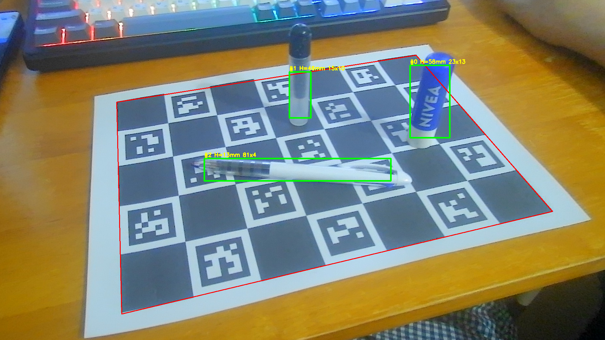

# 07 · 단안 깊이(Depth Anything V2) + ArUco 앵커링 → 높이·부피

**목적:** 웹캠 사진 한 장으로 RGB-D 없이 물체별 높이·부피를 추정.

*ArUco 평면으로 앵커링한 "보드평면 위 높이맵" — 물체가 솟은 영역으로 나타난다.*

*높이 임계로 물체를 색 없이 검출.*

## 원리
1. DA V2 = 상대(affine-invariant) 깊이.
2. **ArUco로 보드평면의 실제 미터 깊이를 알므로**, 보드 픽셀에서 `1/Z = A·pred + B` 피팅 → 상대→미터 **앵커링**.
3. 픽셀 3D 복원 → **보드평면 위 높이맵**. 높이>임계 = 물체(평면은 0이라 자동 제외).

## 보너스
- 높이 임계만으로 물체가 보드에서 깔끔히 분리(색·참조·FastSAM 선별 불필요).

## 주의
- **높이 부호**는 카메라 쪽이 +가 되게 `up = sign(-(n·t))` 곱해야 함.
- DA는 추정이라 높이 과소평가 경향 → 08에서 ArUco 기하로 보정.
- 앵커 품질은 R²로 확인(보드가 크고 평평하게 보일수록↑).

## 관련 함수
[`load_depth_model`, `height_map_from_depth`, `detect_objects_by_height`, `colorize_height`](modules.md#depth_volume)
