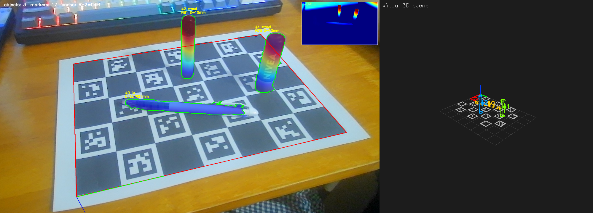
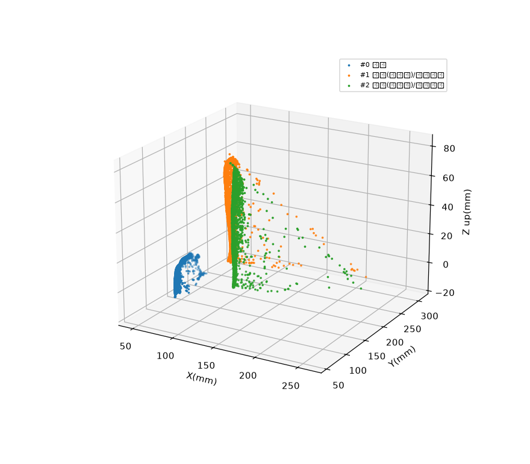

# 09 · 가상 3D 배치 + 인터랙티브 뷰어

**목적:** 검출 물체를 가상 3D 공간에 **원통/박스 프리미티브**로 배치하고, **전체 마커 지도**와 함께 표시. 실시간 add/remove + 마우스 인터랙티브 뷰.

*가상 3D 씬: 전체 마커 지도(평면) 위에 물체가 프리미티브로 배치. id0=빨강(원점).*

*물체 3D 점군 → 자세 판별.*

## 핵심
- **자세**: 축을 DA-PCA가 아니라 **ArUco 분류(수직/누움)에 고정** → 카메라 거리에 따른 DA 기울어짐 방지(수직 물체는 항상 수직).
- **모양(박스/원통)**: 단일 시점에선 서 있는 원통 옆모습이 사각형이라 **실루엣만으론 구분 불가**. 기본 원통(보수적), 확실할 땐 `shape_mode='box'`로 강제. 자동 구분은 다중시점이 정답.
- **마커 지도**: `board_marker_map`으로 전체 마커를 검출과 무관하게 항상 표시(가려져도 안 사라짐). 분산 앵커로 확장 시 저장한 지도를 `marker_map=`로 전달.
- **인터랙티브 뷰어**: `render_plotly`로 마우스 회전/확대/이동 가능한 3D(HTML: `output/virtual_scene.html`). 다른 기능과 접목하기 좋음.

## 관련 함수
[`fit_cylinder`, `classify_shape`, `render_virtual_scene`, `render_plotly`](modules.md#scene3d), [`board_marker_map`](modules.md#aruco_utils)
