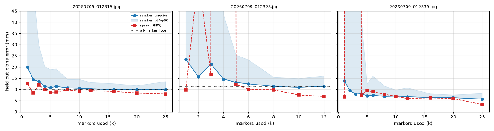
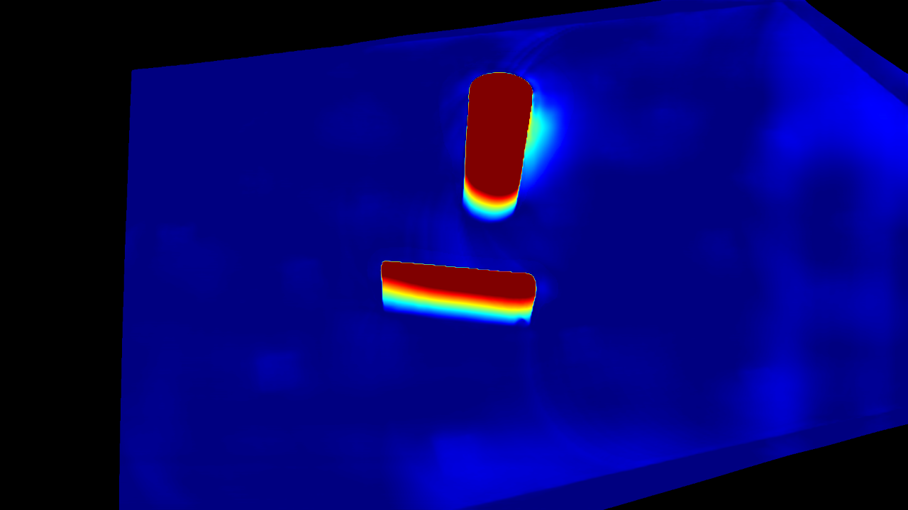
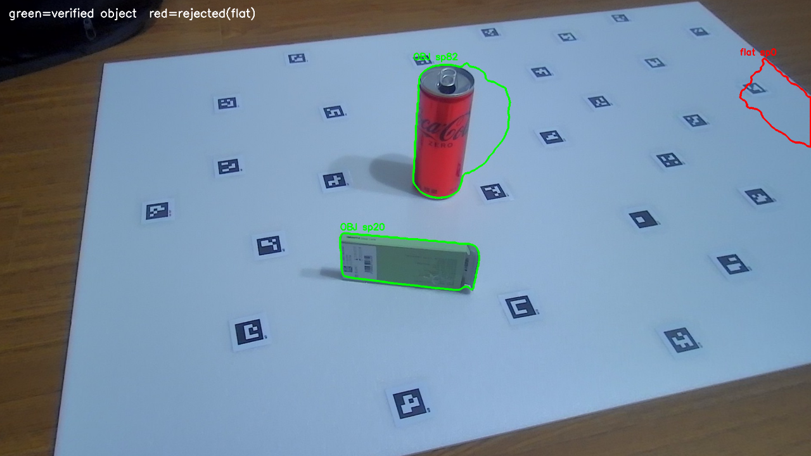
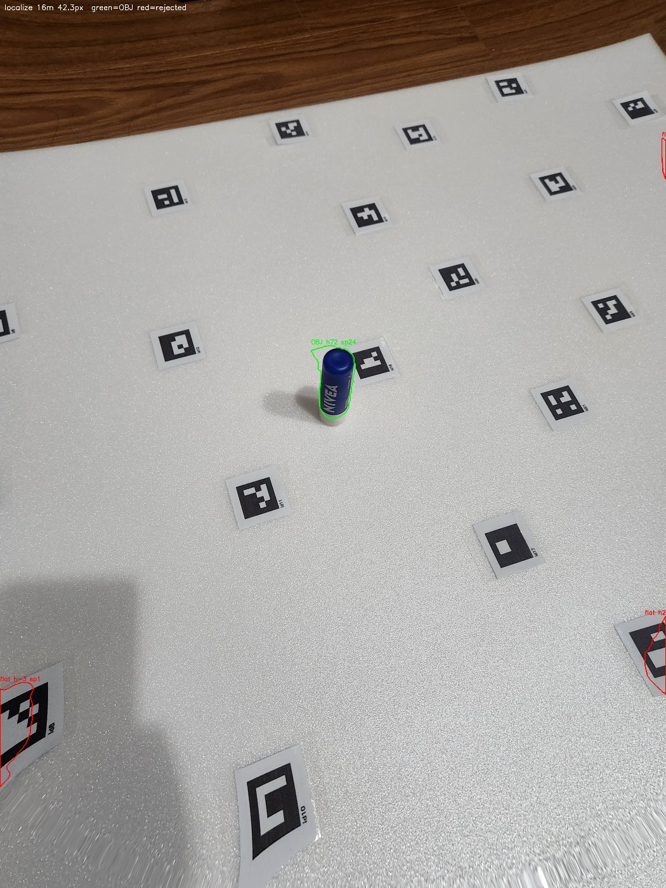
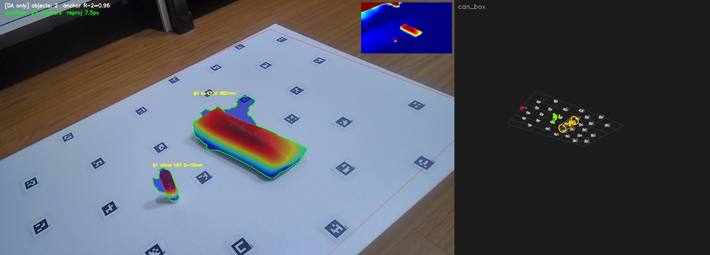
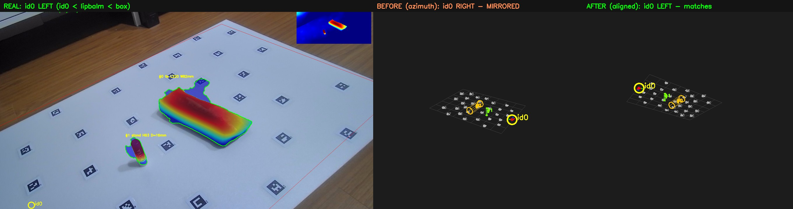
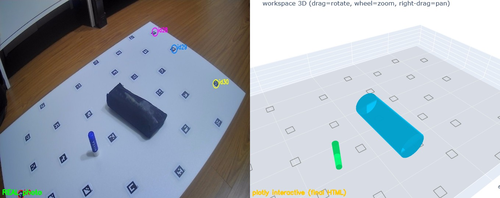

# 13–15 · 분산 앵커 작업공간 + 실시간 (Distributed-Anchor Workspace)

소형 ChArUco 보드가 하던 **평면·좌표계·스케일** 역할을, 넓은 작업공간(600×1000mm)에 흩뿌린 **마커 지도**로 대체한다. 카메라가 움직이거나 물체에 가까이 가도, 보이는 마커 몇 개만으로 로컬라이즈해 넓은 공간 어디서든 물체를 검출·측정·3D 배치한다. 최종 목표는 로봇팔 작업공간.

| 노트북 | 내용 |
|---|---|
| `13_workspace_integration.ipynb` | 마커 지도 로드 · 로컬라이제이션 · 파이프라인 통합 · 검증 |
| `14_realtime_workspace.ipynb` | 웹캠 실시간 루프(분산 앵커) |
| `15_realtime_tophat.ipynb` | top-hat 국소대비 검출 통합 · 방향 정렬 · 인터랙티브 3D |

---

## 1. 마커 지도 & 카메라 캘리브레이션

- **마커 지도**(`output/marker_map.json`): 600×1000mm 보드에 id0~30(각 22mm, DICT_4X4_50)을 분산 부착, 전 마커가 보이게 19장 촬영 → id0 기준 각 마커의 3D 위치(코너/중심, mm).
  - 구축: id0 코너로 초기 호모그래피 → **공통 마커 전부로 반복 정제(findHomography)**. 단일 마커만 쓰면 std 77mm(작은 베이스라인 외삽 폭발), 공통 마커 전부 쓰면 **std 0.35mm**로 급수렴.
- **캘리브레이션**: 지도 구축에 쓴 19장을 그대로 캘리브 타겟으로 재사용(`ws.calibrate_from_map`, Zhang 평면법). 근사 K(hfov 60)와 fx가 ~1%만 달라 초점거리는 이미 양호, 주점(cx,cy) 보정에 의미.
- **로컬라이제이션**(`ws.localize`): 검출 마커 코너(2D) ↔ 지도 3D(Z=0)로 `solvePnP`(IPPE, 평면 타겟) → 카메라 포즈(id0 기준) + 재투영 오차.

## 2. 최소 앵커 수 실험

"마커 k개만으로 로컬라이즈하면 작업공간 어디든 물체를 몇 mm 오차로 놓나"를 측정. 지표 = **held-out 마커 평면위치 오차(mm)**(선택한 k개로 포즈 추정 → 안 쓴 마커 픽셀을 평면 역투영 → 지도 실제 위치와 비교).



- **1개 = 금지** — 포즈 애매(p90 100~650mm).
- **랜덤 2개도 위험** — 최악 꼬리(p90 50~76mm).
- **잘 분산된 4~5개면 충분** — 전체(30개)를 써도 개선 미미(바닥 도달).
- **바닥 오차 ~6~10mm는 마커 개수가 아니라 지도/캘리브 절대정확도의 한계** — 더 낮추려면 마커를 늘리는 게 아니라 지도/캘리브 품질을 올려야 함.
- **분산 > 개수** — 단, 순수 "가장 먼 마커" 선택은 일직선/가장자리 편중 배치를 골라 퇴화(폭발)할 수 있음 → 규칙은 **"2D로 넓게, 일직선·가장자리 편중 피하기"**.

> **실전 권장: 작업영역에 마커 4~5개를 2D로 넓게 배치. 1~2개 의존 금지.**

## 3. top-hat 국소대비 검출

절대높이 임계(높이 > 6mm)의 약점 — 낮은/어두운 물체를 놓치고, 넓고 비스듬한 뷰에서 평면 드리프트로 **가짜 거대 블롭**이 생김. → **모폴로지 top-hat(국소 배경 롤링볼 차감)** 으로 "주변보다 솟은 곳"만 검출.



*캔·박스만 빨갛게(주변보다 융기), 나머지 보드는 균일한 파랑(=물체 없음 확실). 오른쪽 평면 드리프트도 제거됨.*

**검출 파이프라인** (`process_frame_da(detect="tophat")`, 기본값):

1. DA 높이맵(앵커 평면 기준)
2. `top-hat = 높이 − 국소배경(다운스케일 grayscale opening)` → 저융기 물체 포착 + 저주파 드리프트 제거
3. 후보 = `top-hat > tophat_mm` ∧ 보드 XY(둘레 안쪽 축소 `xy_margin_mm<0` → 보드 가장자리 들뜸 배제)
4. **봉우리 검증** = `peak > peak_min_mm` ∧ `편차(peak−median) > spread_min_mm` → 평평한 경계/드리프트 아티팩트 거부
5. 측정 = 앵커 절대높이로 크기·자세(**탐지 ≠ 측정** 분리). 자세는 세로/가로 비율로 서있음/누움 판별(밑동 그림자 제외 윗부분 폭 사용)



*초록 = 검증 통과(캔 편차 82, 박스 20), 빨강 = 거부(우측 평평한 램프, 편차 0.4).*

**3중 방어선**: 경계 축소(보드 둘레 들뜸) + 편차 검증(평평한 램프/단차) + top-hat(저융기·원거리·어두운 물체 포착).

## 4. 검출 검증



립밤을 보드 물리중심(id0 기준 기대 위치 ~(0,430)mm)에 두고 촬영 → **근접샷(전체 보드 안 보임)에서도** 주변 마커만으로 위치 (+8,+441)mm·크기 H67/D16(실측 69/19)로 복원. 원거리 립밤도 top-hat으로 포착.



서 있는 캔(H146/D45)과 **누운 어두운 박스**(L220/W82)를 동시 검출 — 절대높이 방식은 낮은 박스를 놓쳤지만 top-hat은 둘 다 잡는다. 오른쪽은 가상 3D 배치.

## 5. 가상 3D 방향 정렬

가상 3D 씬을 **실제 카메라 포즈 방향에 정렬**해 실제 뷰와 좌우·앞뒤·상하를 일치시킨다.



- **OpenCV 고정 뷰**(`render_virtual_scene`, 실시간 옆 패널): `_lookat_aligned`가 실제 카메라 R의 수평 right/forward를 승계(roll 제거) → 방위각만 맞추면 카메라가 회전된 프레임에서 좌우가 뒤집히는 문제 해결.
- **origin_mm**: id0 기준 음수 좌표를 0~작업공간 격자에 정렬.

## 6. 인터랙티브 3D 뷰어

`render_plotly` → 자체 포함 HTML(**드래그=회전, 휠=확대, 우클릭드래그=이동**, 오프라인 작동). 물체는 solid 원통/박스, 마커 31개 + 원점 축.



*plotly 3D는 카메라 이미지와 좌우 반사(handedness) 관계 → **`yaxis` 축 방향만 뒤집어**(autorange reversed) chirality를 전역 교정(좌표 값은 true 유지: id28은 그대로 (548,894)로 읽힘). 초기 카메라는 실제 방향에 맞춤.* 결과적으로 실제 사진과 마커·물체 배치가 일치.

## 7. 실시간 루프

`ld.run_live_workspace(...)` — 매 프레임: 마커 지도 로컬라이즈 → top-hat 검출 → **카메라 합성 | 가상 3D** 나란히. `[s]` 스냅 시 `ws_raw/ws_vis` PNG + `ws_3d_###.html`(인터랙티브) 자동 저장.

```python
Kw, distw = au.load_intrinsics('output/camera_intrinsics.npz')   # 그 웹캠의 K
ld.run_live_workspace(Kw, distw, corners_map, markers_list, PLANE, pipe=pipe,
                      cam_index=0, calib_wh=(1920, 1080), snapshot_dir=OUTPUT_DIR, min_area_px=1200)
```

**셋업 체크리스트**: ① 웹캠을 작업공간 위 근접/탑다운 고정(정확). ② 프레임에 마커 4~5개가 2D로 퍼져 보이게. ③ 그 웹캠 ChArUco 1회 캘리브(`camera_intrinsics.npz`). 성능: DA 매 프레임이라 GTX1660 ~2fps.

## 8. 한계

- **원거리 전체 보드 샷**은 작은 물체(≈19mm)를 DA가 해상 못 함 → 가까이 촬영(로봇팔은 근접/탑다운 고정이라 해당).
- **아주 얇고 균일한 물체**(종이 한 장)는 국소 편차가 작아 놓칠 수 있음 — 단안 DA의 본질적 한계(다중시점 필요).
- **바닥 오차 ~6~10mm**는 지도/캘리브 절대정확도가 결정.
- 캔 윤곽에 그림자 스커트 잔존(측정은 중간높이 슬라이스라 정확).
