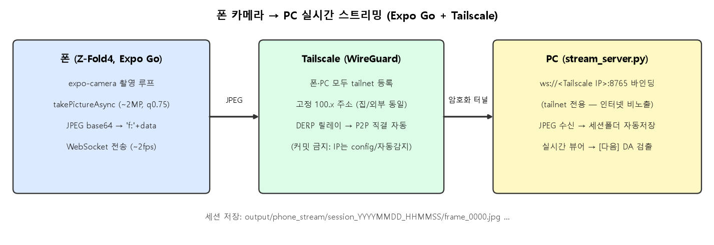

# 16 · 폰 카메라 → PC 실시간 스트리밍 (Expo Go + Tailscale)

웹캠 대신 **안드로이드 폰 카메라**를 입력원으로 쓴다. 폰(Expo Go 앱)이 카메라 프레임을 WebSocket으로 PC에 실시간 전송하고, PC(`src/stream_server.py`)가 수신·표시·저장한다. 네트워크는 **Tailscale**로 고정 — 집이든 외부든 같은 주소로 접속된다. 최종 목표: 이 스트림을 분산앵커 DA 파이프라인에 연결해 **폰으로 비추면 PC가 실시간 객체인식**.



| 구성 | 파일 |
|---|---|
| 폰 앱 (Expo, SDK 54) | `mobile/App.js` (+ `mobile/config.js` — gitignore, IP 보관) |
| PC 수신 서버 | `src/stream_server.py` |

---

## 1. 왜 이 구조인가

- **Expo Go 제약**: WebRTC(진짜 영상 스트림)는 네이티브 모듈이라 Expo Go에서 불가 → **`takePictureAsync` 루프로 JPEG 연사 전송**(WebSocket). 폰 실측 ~1.8fps.
- **그거면 충분**: PC 검출 파이프라인(DA 추론)이 GTX1660에서 ~2fps 천장이라, 입력이 그보다 빨라도 버려진다. 실시간 검출 기준 1.8~2fps 입력은 병목이 아니다.
- **Tailscale 채택 이유(실측)**: PC는 유선 공인 IP 직결, 폰 Wi-Fi는 **다른 서브넷**으로 확인됨(같은 LAN 아님). 공인 IP는 바뀔 수 있고 외부에서 못 쓰므로, 폰·PC를 tailnet에 등록해 **고정 100.x 주소**로 통신. 연결은 DERP 릴레이로 시작해 자동으로 **P2P 직결(61ms)** 전환 확인.

## 2. 보안 설계

- **서버는 Tailscale 인터페이스에만 바인딩** — PC가 공인 IP 직결이라 `0.0.0.0`으로 열면 인터넷 전체에 노출된다. 기본값은 **PC 자신의 Tailscale IP를 자동 감지**(`tailscale ip -4` → 인터페이스 스캔 폴백)해 바인딩 → tailnet에 로그인된 내 기기만 접속 가능.
- **IP를 저장소에 커밋하지 않음** — 서버는 자동 감지라 하드코딩이 없고, 앱은 `mobile/config.js`(gitignore)에서 로드. 저장소에는 `config.example.js`(플레이스홀더)만 커밋.

## 3. 구축 중 겪은 문제 → 해결

| 문제 | 원인 | 해결 |
|---|---|---|
| `create-expo-app` 실패 (`File is not defined`) | Node v18.15가 구식(최신 도구는 Node 20+ 전역 API 사용) | Node LTS(v24)로 업그레이드(winget) |
| Expo Go에서 "Project is incompatible" | 스캐폴드가 SDK 57인데 Play 스토어 Expo Go는 SDK 54 지원 | `--template blank@sdk-54`로 재생성(폰 Expo Go 버전에 맞춤) |
| 폰→PC 연결 타임아웃 | WS 서버 미실행(폰의 접속 대상 부재) | 서버 기동 확인 절차 추가(리스닝 포트 점검) |
| Tailscale 버튼 실패 | 폰이 tailnet 미등록 | 폰에 Tailscale 앱 설치 + 동일 계정 로그인 |
| `Invalid SOS parameters` 경고 다수 | `skipProcessing` JPEG의 비표준 마커(libjpeg 경고) | **무해** — 디코드·표시 정상. 무시 |

## 4. 폰 앱 (`mobile/`)

- `expo-camera`의 `CameraView` + `takePictureAsync({ base64, quality:0.75, skipProcessing, shutterSound:false, exif:false })` 루프.
- 해상도: 기기 지원 목록에서 **~2MP(1920×1440 근처)** 자동 선택(`getAvailablePictureSizesAsync`) — 캘리브레이션·검출 품질과 전송량의 균형.
- 전송 형식: `"f:" + base64(JPEG)` 텍스트 프레임(RN WebSocket에서 가장 단순·안정).
- UI: 카메라 프리뷰 + [연결](ping RTT 표시) + [스트리밍 시작/정지] + 전송 수·fps·KB/장.
- 실행: `cd mobile && npx expo start --lan` → Expo Go로 QR 스캔. 최초 1회 `config.example.js`를 `config.js`로 복사해 PC Tailscale IP 기입.

## 5. PC 서버 (`src/stream_server.py`)

```
python src/stream_server.py [port] [host]   # host 생략 시 Tailscale IP 자동 감지
```

- `ping` → `pong`(연결 테스트), JPEG(바이너리 또는 `f:`base64) → 디코드.
- **세션별 자동 저장**: 연결(스트리밍 세션)마다 `output/phone_stream/session_YYYYMMDD_HHMMSS/` 폴더를 새로 만들고 수신 **원본 JPEG을 재인코딩 없이 전부 저장**(화질 보존) — 이 프레임들이 스트림 해상도 캘리브레이션 재료가 된다.
- 실시간 뷰어 창(해상도·fps·프레임번호 오버레이), `[q]` 종료.
- `latest_frame` 전역에 최신 프레임 보관 — 검출 파이프라인이 소비할 접점.

## 6. 실측 결과

- 연결: Expo Go(SDK 54) 앱 로드 → WebSocket 연결 OK, Tailscale 경유 P2P 직결.
- 스트리밍: **720×960 → ~2MP(설정 상향), 장당 ~176KB(q0.5 기준), 폰 기준 ~1.8fps**, PC 실시간 표시 정상.

## 7. fps에 대한 솔직한 정리

- `takePictureAsync`는 **정지사진 파이프라인**(장당 ~500ms)이라 Expo Go에서는 **~2fps가 현실적 한계**. 5fps+가 필요하면 Expo Go를 벗어나야 함(dev build + `react-native-vision-camera` 프레임 프로세서, 또는 WebRTC) — 향후 옵션.
- 그러나 **실시간 검출 목적에는 지금 fps로 충분**: PC의 DA 추론이 ~2fps 천장이므로, 초점은 "입력 fps 올리기"가 아니라 **밀리지 않는 소비 구조**다.
- **밀림 방지 설계(다음 단계에 적용)**: 서버는 항상 `latest_frame` 하나만 유지(수신 즉시 덮어씀), 검출 워커는 자기 속도(~2fps)로 최신 프레임만 꺼내 처리 → 큐가 쌓이지 않아 지연이 누적되지 않음(오래된 프레임은 자연 폐기).

## 8. 스트림 해상도 캘리브레이션 (완료)

`src/calibrate_stream.py` — 마커 보드를 여러 각도로 스트리밍한 세션 폴더로 `ws.calibrate_from_map`(25뷰 균등 샘플) 실행 → `output/phone_stream_intrinsics.npz`.

- **실측: 25뷰, RMS 5.6px, fx=1174 @1440×1920** (사진모드 캘리브 RMS 31px 대비 크게 개선).
- **사진모드 K를 스케일하면 fx≈1260이어야 하는데 실측 1174 (~7% 차이)** — 폰의 사진/영상 모드 화각이 실제로 다름이 확인됨 → **스트림 전용 캘리브가 필수**였다.

## 9. 실시간 검출 연결 (완료)

`python src/stream_server.py --detect` — 검출 워커가 분산앵커 파이프라인(`process_frame_workspace`)을 스트림에 연결.

- **최신 프레임만 소비**: 수신은 `latest_frame` 덮어쓰기만, 워커는 자기 속도로 최신 것만 처리 → 큐가 쌓이지 않아 밀림/지연 누적 없음(§7의 설계 그대로).
- K는 `phone_stream_intrinsics.npz` 로드, 프레임 해상도가 다르면 자동 스케일(캘리브 없으면 근사 K 폴백+경고).
- 표시: 카메라(검출 오버레이) | 가상 3D + 검출fps/수신fps.
- **라이브 실측**: 립밤 검출(stand, D~16mm ≈ 실측 19), 로컬라이즈 16마커 5.4px, 앵커 R²=0.99, 가상 3D 배치 정상. detect 0.6fps ≈ recv 0.7fps — **병목은 PC가 아니라 폰의 촬영·전송**(2MP q0.75). 앱에 **고화질(2MP q0.75) ↔ 속도(1MP q0.6) 프리셋 토글** 추가.
- 정확도 주의: 비스듬·원거리 뷰에서 DA 높이 과대 경향(립밤 H105 vs 실측 69) — 근접/탑다운 촬영에서 정확(13~15 결론과 동일).

## 10. 다음 (선택)

- 검출 결과를 폰으로 회신해 폰 화면에 표시(AR 오버레이).
- 더 높은 fps가 필요하면 dev build + `react-native-vision-camera`(프레임 프로세서) 또는 WebRTC.
